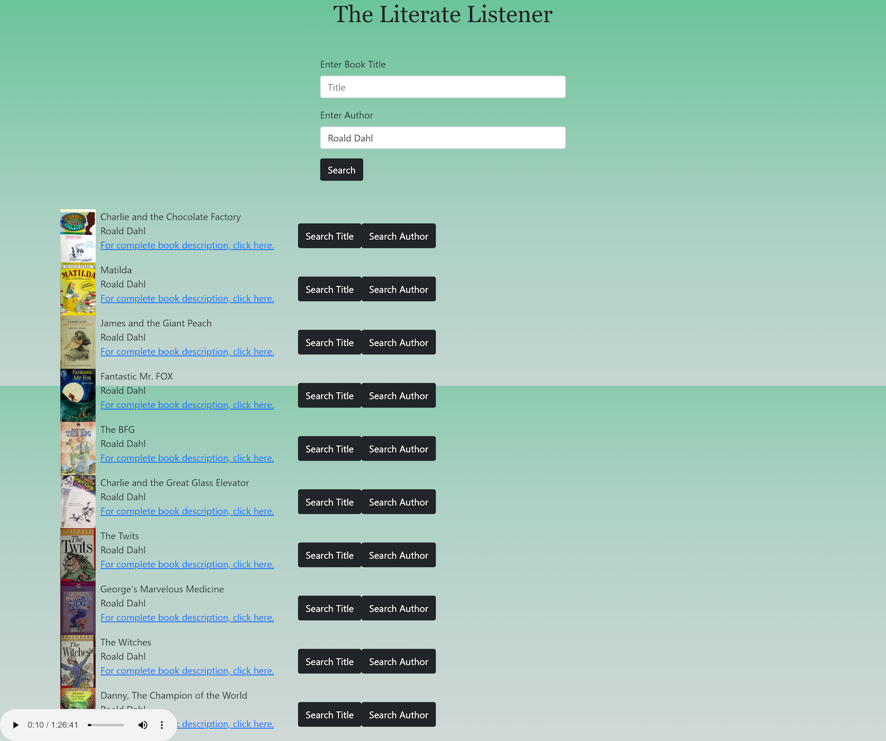
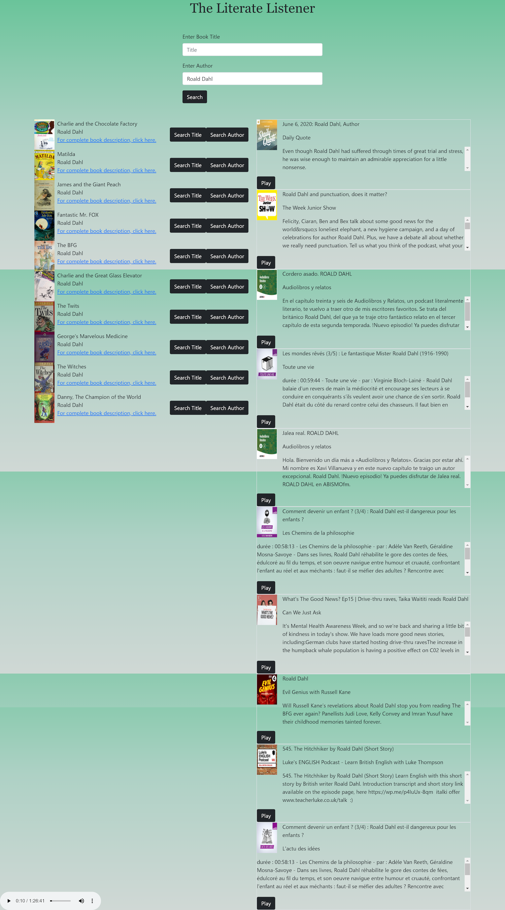

# The Literate Listener
## Description 

Our team has created a webpage that brings together the avid reader and the avid podcast listener who is interested in delving deeper into a topic that interests them.  This webpage will allow the user to enter the title of a book or author and receive a list of podcasts related to the same topics.  It can also perform a reverse search and provide the user with books related to topics covered in specific podcasts.  Using the Open Library API, we receive the book title, author, and description to populate the book field.  We then use the following returns to fill the podcast query URL: title, subjects, subject places, subject people.  The Listen API will return a list of podcasts in a playlist format so the user can click and play from the page.  

Our group posited that avid readers and podcast listeners would derive great utility from a page that provides them with podcast search results for related topics, or books related to topics covered in a podcast.  Consider the site similar to a music playlist service that recommends similar artists, but with enhanced features.  Even in the study of full stack web development, books on Javascript can be recommended, as well as related podcasts, such as Wes Bos' syntax podcast.  Regardless of the subject being studied, users would greatly benefit from connecting books and podcasts by finding podcast episodes that specifically relate to whatever subject we are studying.

User Story:
As an avid reader I want to find podcasts related to a particular book or author so that I can dive deeper into that topic and hear related opinions.

GIVEN: I am on the page
WHEN: I search for a book by title or author (or reverse-search for a podcast).
THEN: I will receive a list of podcasts (or books, if reverse-searching) related to the book’s subject matter.

### Technologies Used:  
- JavaScript: logic and Ajax  
- Ajax: to make API calls  
- Bootstrap: containers, alignment  
- jQuery: DOM manipulation  
- API's
    - [Open Library](https://openlibrary.org/developers/api)
    - [Listen Notes](https://www.listennotes.com/api/)
    - [IBM Natural Language Understanding](https://cloud.ibm.com/apidocs/natural-language-understanding)

### Challenges Faced:
Flex containers and alignment were challenging due to the amount of query searches we were trying to bring together.  Coordinating the API's to perform their searches properly presented some challenges, as well.  Being able to parse out what terms to search for to get in to the query url.  CORS issues arose, as well.  

### Future Features:
- Use `localStorage` to allow a user to save podcast episodes they liked or books for future reading.
- Improve on podcast to book suggestions.
- Implement pagination on book and podcast results to see more than the intially displayed results.
- Searching for books via subject/genre.

Motivation:
To capitalize on the interest one has in a particular subject, leveraging API's for enhanced search results.

Why did we build this project? 
Aside from providing a niche search service for avid readers and podcast listeners who want a deep dive on a given topic, we built this project to develop our skills in API functionality and utility; to be able to combine multiple API searches into a viable product with real utility.  

What did we learn? 
Digging deep into the API and Bootstrap documentation can result in learning quite a bit.  It’s easy enough to make one API work once query and syntax is sorted out, but we discovered it can be challenging to make multiple API's work together, as well as slightly overwhelming in terms of which elements to use, features to include, etc.  Making sure the CSS was performing as expected was also a challenge.

What makes our project stand out?
It’s unique. It’s useful.  It has the potential to be even more useful in people’s everday lives, as we find new and creative ways to expand its functionality and features to include other related media in the future.

Link to deployed page:
https://glorvi23.github.io/project-1/

## Table of contents:

* [Installation](#installation)
* [Usage](#usage)
* [Credits](#credits)
* [License](#license)

## Installation

Installation steps:  Clone the repository to your local machine.  

## Usage 

Open `index.html` in your favorite browser or check out the live version [here](https://github.com/Glorvi23/project-1).

## Credits
Our collaborators with links to github profiles:
    Adrian Ash - https://github.com/ashadria1
    Bradley Donahue - https://github.com/brhue
    Caleb Glorvigen - https://github.com/Glorvi23
    Jacquie Gutierrez - https://github.com/Jacquie24
## License

MIT License

Copyright (c) [2020] [Adrian Ash, Bradley Donahue, Caleb Glorvigen, Jacquie Gutierrez]

Permission is hereby granted, free of charge, to any person obtaining a copy
of this software and associated documentation files (the "Software"), to deal
in the Software without restriction, including without limitation the rights
to use, copy, modify, merge, publish, distribute, sublicense, and/or sell
copies of the Software, and to permit persons to whom the Software is
furnished to do so, subject to the following conditions:

The above copyright notice and this permission notice shall be included in all
copies or substantial portions of the Software.

THE SOFTWARE IS PROVIDED "AS IS", WITHOUT WARRANTY OF ANY KIND, EXPRESS OR
IMPLIED, INCLUDING BUT NOT LIMITED TO THE WARRANTIES OF MERCHANTABILITY,
FITNESS FOR A PARTICULAR PURPOSE AND NONINFRINGEMENT. IN NO EVENT SHALL THE
AUTHORS OR COPYRIGHT HOLDERS BE LIABLE FOR ANY CLAIM, DAMAGES OR OTHER
LIABILITY, WHETHER IN AN ACTION OF CONTRACT, TORT OR OTHERWISE, ARISING FROM,
OUT OF OR IN CONNECTION WITH THE SOFTWARE OR THE USE OR OTHER DEALINGS IN THE
SOFTWARE.

---

## Badges

## Features
- book search by title/author
- podcast search once that list populates
- play the podcast from the site
- search for the podcast episodes  

